class: inverse, middle, center

```{r, load_refs, include=FALSE, cache=FALSE}
library(RefManageR)
BibOptions(check.entries = FALSE,
           bib.style = "alphabetic",
           cite.style = "alphabetic",
           style = "markdown",
           hyperlink = FALSE,
           dashed = FALSE)
myBib <- ReadBib("./esp_bib.bib", check = FALSE)
```

# Desigualdade de renda e de riqueza

---
class: middle
# Desigualdade mundial de renda

A desigualdade mundial de renda se divide entre desigualdade *dentro* dos países e desigualdade *entre* países

Em termos de desigualdade de renda entre países, temos países ricos, de renda média e de renda baixa, com diferenças significativas em padrão de vida, mesmo em paridade de poder de compra

Em linhas gerais, a renda média mensal por adulto em PPP é:
- Na América do Norte, $5.490 (3x a média mundial de 1.740)
- Na União Européia, $3.420 (2x a média mundial)
- Na China ou América Latina, $1.520 (90% da média mundial)
- Na África Subsaariana, $560, ou 30% da média mundial

---
class: middle

```{r, echo=FALSE, out.width = '95%'}
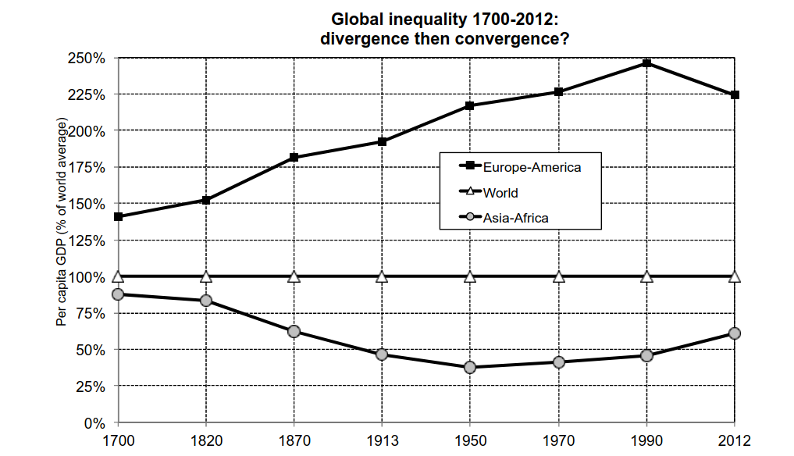
```

Em 1700, não havia basicamente nenhuma desigualdade *entre* países, mas ela foi crescendo ao longo dos últimos 3 séculos, começando a cair apenas por volta de 1980 (Zucman)

---
class: middle

```{r, echo=FALSE, out.width = '95%'}
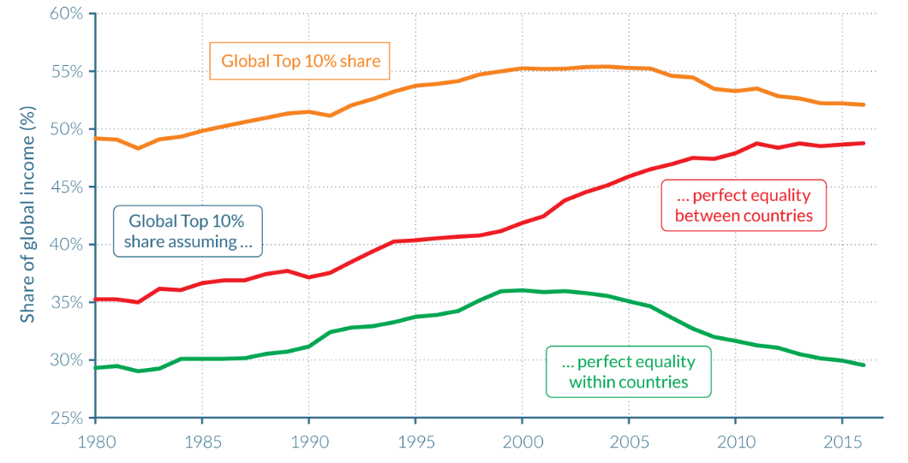
```

A desigualdade *dentro* dos países é mais importante, e cada vez mais importante relativa à desigualdade *entre* países (Zucman)

---
class: middle

```{r, echo=FALSE, out.width = '95%'}
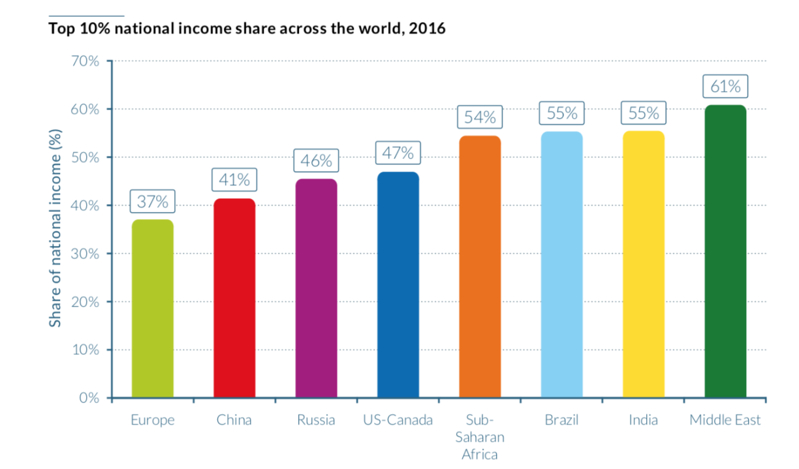
```

Mas a desigualdade *dentro* dos países também varia muito entre diferentes países do mundo (Zucman)

---
class: middle

```{r, echo=FALSE, out.width = '95%'}
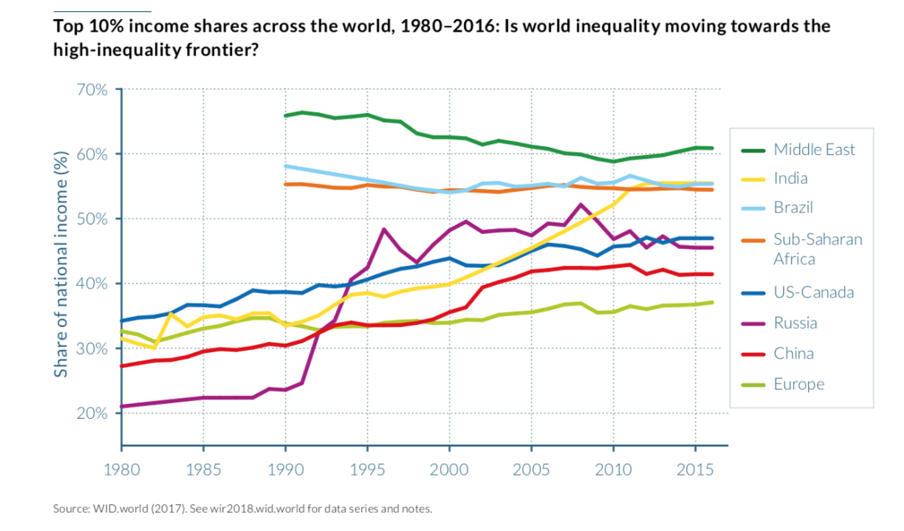
```

E tem se alterado no tempo de formas diferentes (mas em geral com tendência de aumento desde 1980) (Zucman)

---
class: middle

```{r, echo=FALSE, out.width = '95%'}
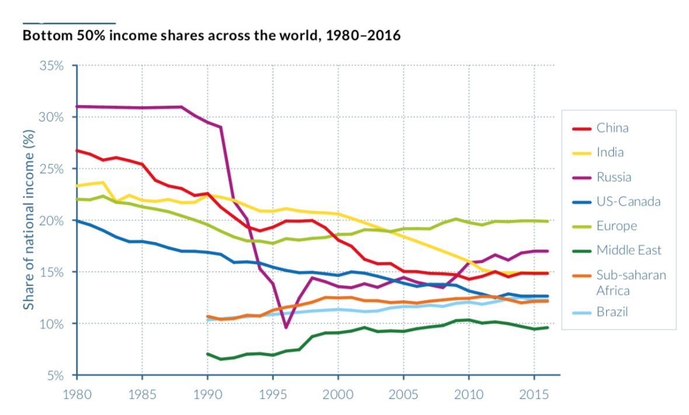
```

Tendências internacionais do 50% mais pobre (Zucman)


---
class: middle

```{r, echo=FALSE, out.width = '95%'}
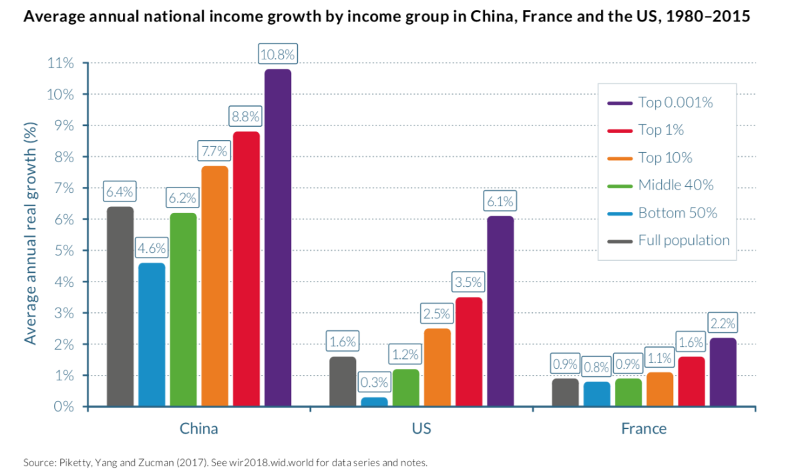
```

O aumento da desigualdade pode se dar com crescimentos significativos de renda em todos os estratos, como na China, mas nos EUA a renda dos 50% de baixo quase estagnou nos últimos 50 anos (Zucman)


---
class: middle

```{r, echo=FALSE, out.width = '70%', fig.align="center"}
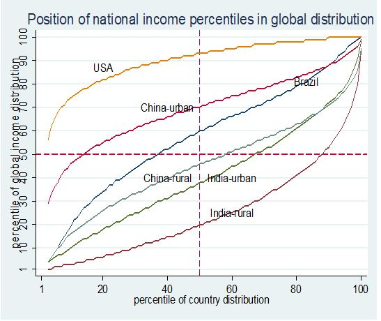
```

Enquanto no Brasil os 5% mais pobres tem a renda igual aos 5% mais pobres da Índia ou da área rural da China, os 1% mais ricos aqui tem a mesma renda do 1% mais ricos nos EUA [@BrankoMilan](https://twitter.com/BrankoMilan)

---
class: middle

```{r, echo=FALSE, out.width = '50%', fig.show="hold"}
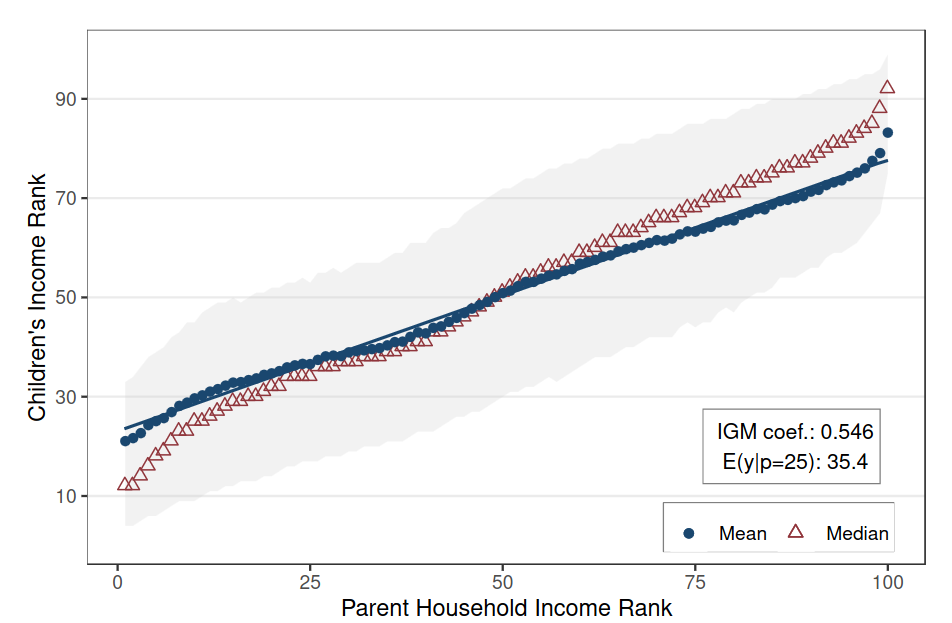
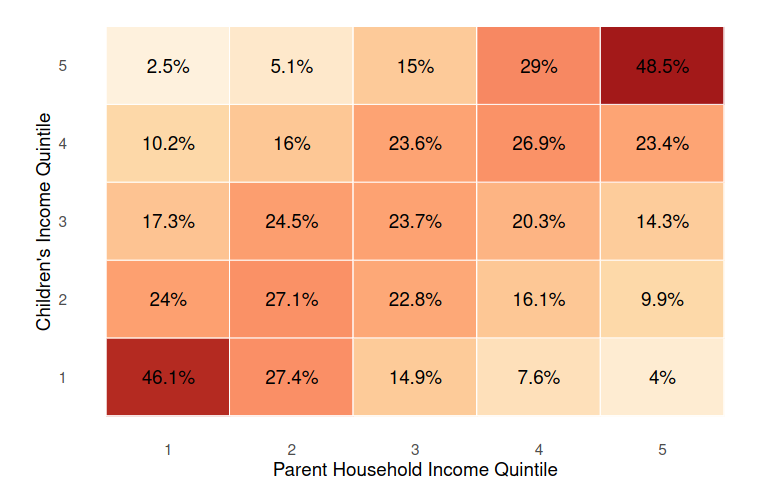
```

De forma coerente com a **curva de Gatsby**, o Brasil não apenas tem enorme desigualdade de renda, como também desigualdade intergeracional: uma criança nascida em família do quintil superior tem quase 50% de chance de se manter nele, assim como uma nascida no quintil inferior `r Citep(myBib, "gc2022intergenerational")`

---
class: middle

```{r, echo=FALSE, out.width = '70%', fig.align="center"}
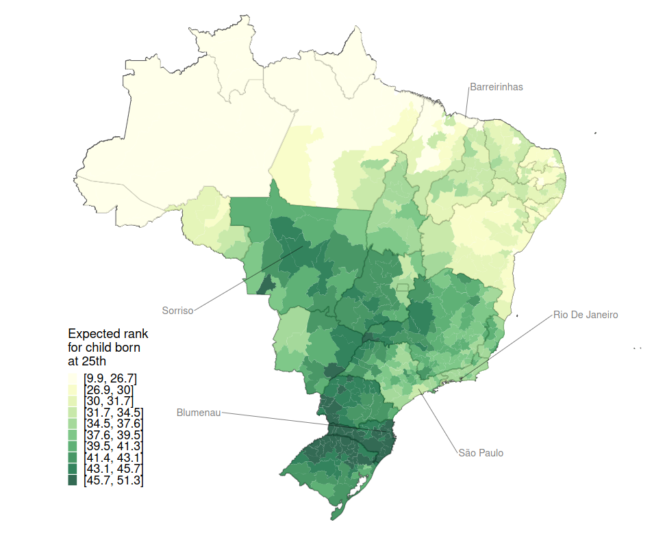
```

A mobilidade intergeneracional é menor no Norte e Nordeste, e maior no Sul, Sudeste e Centro-oeste &mdash; mas é mais baixa nas capitais, como Rio e São Paulo `r Citep(myBib, "gc2022intergenerational")`


---
class: middle
# Desigualdade de riqueza

A desigualdade de riqueza, e portanto de renda do capital, é sempre muito maior que a desigualdade de renda do trabalho

Os 10% mais ricos em geral tem por volta de 20-30% da renda do trabalho, mas 50-90% da renda do capital

Os 50% mais pobres tem 20-30% da renda do trabalho, e basicamente 0 renda do capital


---
class: middle

```{r, echo=FALSE, out.width = '75%', fig.align='center'}
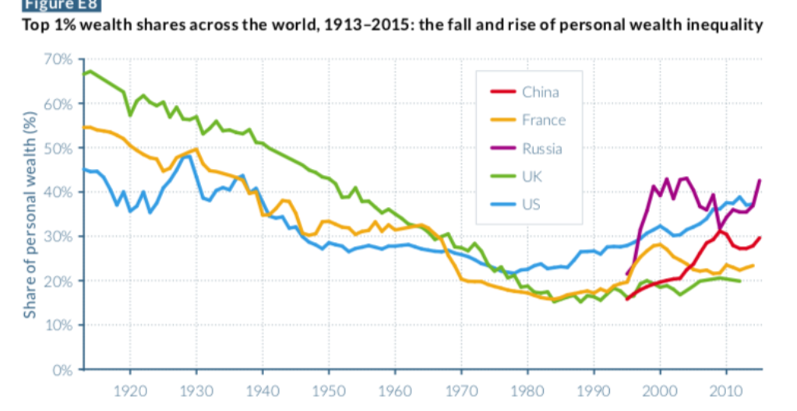
```

Proporção da riqueza privada possuída pelo 1% mais rico (Zucman)

---
class: middle

```{r, echo=FALSE, out.width = '95%'}
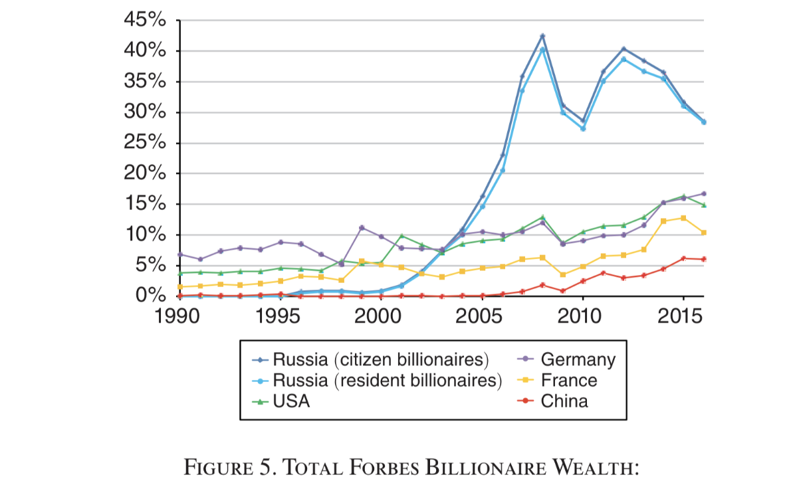
```

Riqueza dos bilionários como proporção do PIB (não da riqueza, que nos EUA é por volta de 3,5%) (Zucman)


---
class: middle

```{r, echo=FALSE, out.width = '70%'}
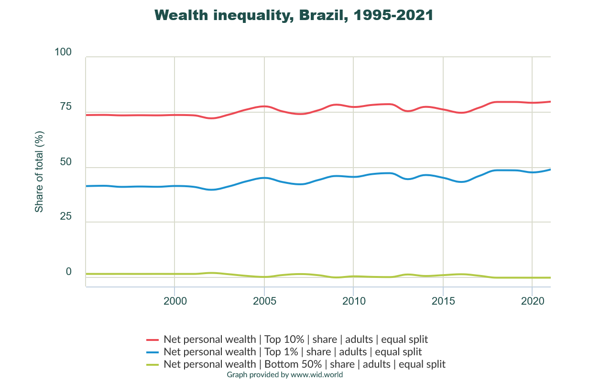
```

A riqueza brasileira é distribuída de forma extremamente desigual (mesmo na comparação internacional): os 10% mais ricos têm por volta de 3/4 da riqueza brasileira, e o 1% mais rico metade &mdash; como é comum internacionalmente, os 50% mais pobres possuem riqueza zero [(WID)](https://wid.world/country/brazil/)

---
class: middle

```{r, echo=FALSE, out.width = '85%'}
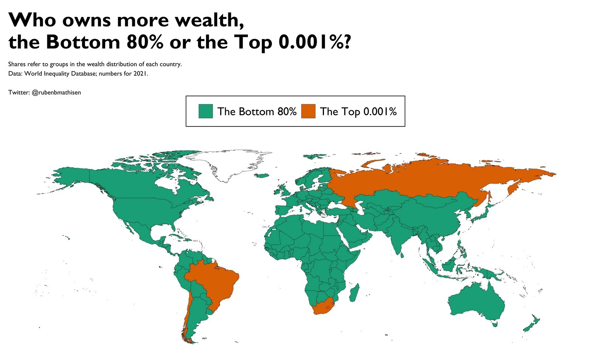
```

O Brasil está entre apenas 6 países no mundo em que os 80% mais pobres têm menos riqueza que o 0,001% mais rico (1/100.000), ou seja, 2.000 pessoas (o tamanho do corpo discente da FEA) têm mais riqueza que 160 milhões de brasileiros juntos [(WID e @rubenbmathisen)](https://twitter.com/rubenbmathisen/status/1508148771225485316)


---
class: middle

```{r, echo=FALSE, out.width = '50%'}
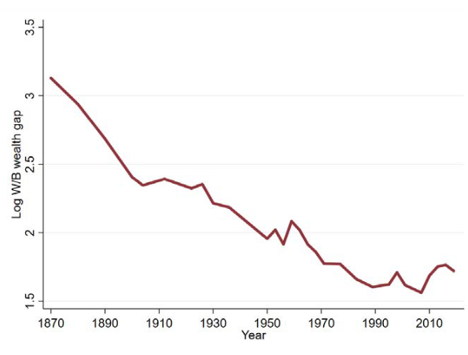
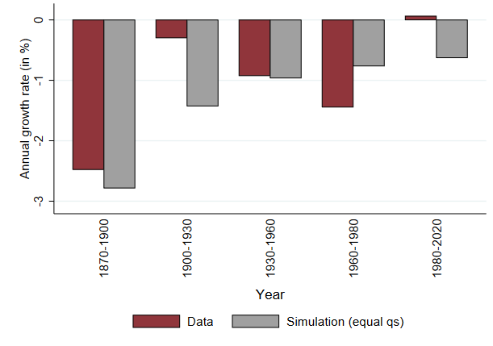
```

Existe também uma **desigualdade racial de riqueza**: nos EUA, em 1860, na Emancipation, a riqueza dos brancos era 56x maior que a dos negros: houve uma melhora acentuada nas décadas seguintes, diminuindo a velocidade no século XX &mdash; até que desde os anos 2000 essa desigualdade *aumentou*, voltando ao nível do Civil Rights Movement na década de 60 (5-7x maior) `r Citep(myBib, "derenoncourt2022wealth")`

---
class: middle, center, inverse

# Papel da economia do setor público


---
class: middle

```{r, echo=FALSE, out.width = '80%'}
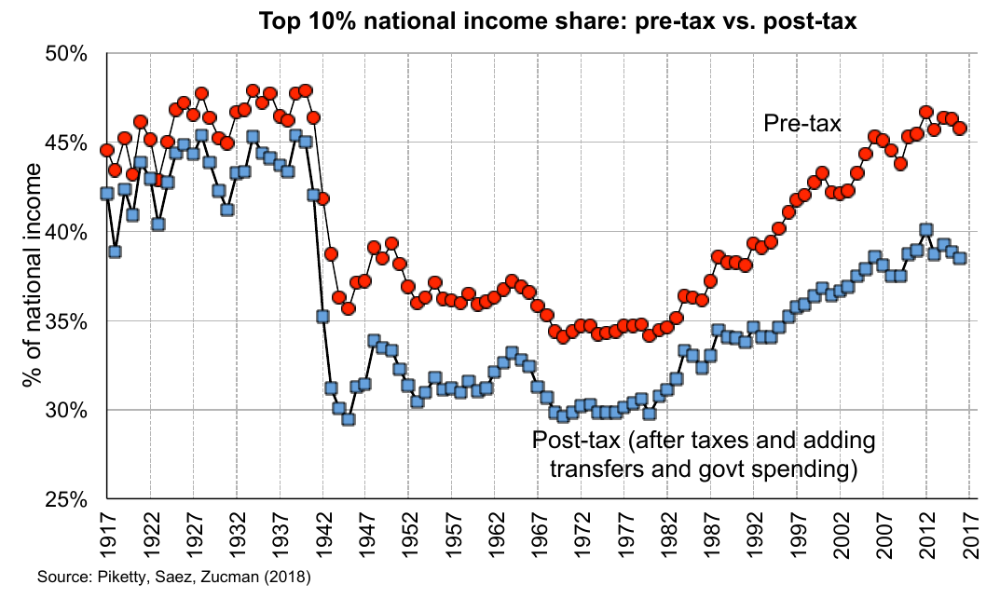
```

Governos têm um papel central em mitigar a desigualdade &mdash; em quase todas as economias modernas, a desigualdade de renda após impostos e transferências é significativamente menor que a desigualdade de renda tributável

---
class: middle

```{r, echo=FALSE, out.width = '85%'}
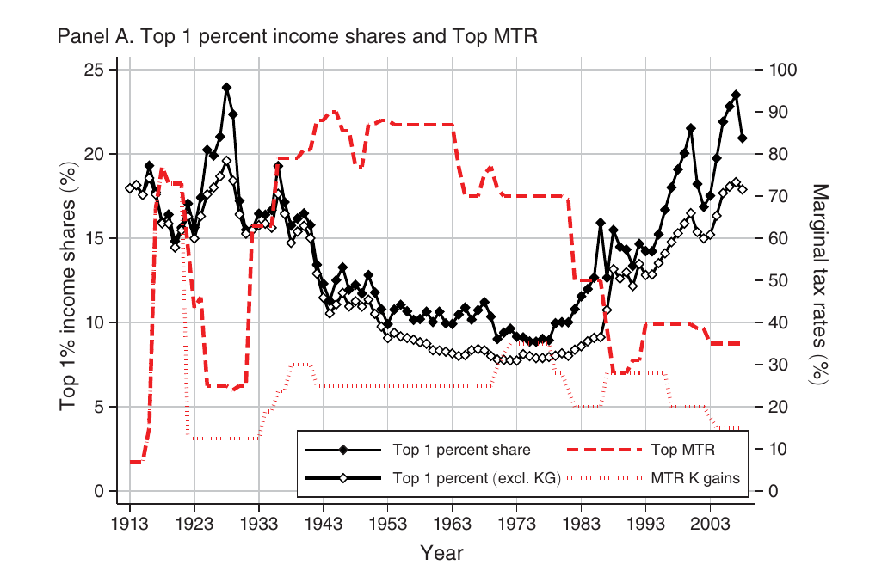
```

A redução drástica na taxa marginal máxima de imposto nos EUA no "Reagonomics" foi acompanhada de crescimento expressivo na proporção do 1% mais rico na renda... `r Citep(myBib, "piketty2014optimal")`

---
class: middle

```{r, echo=FALSE, out.width = '85%'}
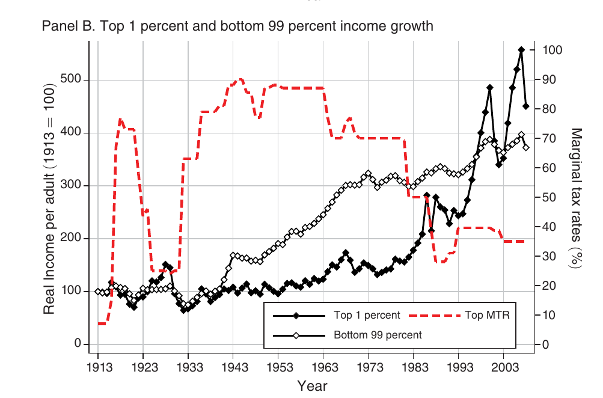
```

... mas não parece ter tido nenhum efeito no crescimento da renda dos outros 99% (se algo, o efeito é negativo): ou seja, há *plausivelmente* pouco efeito econômico real de maior taxação `r Citep(myBib, "piketty2014optimal")` 


---
class: middle

```{r, echo=FALSE, out.width = '85%'}
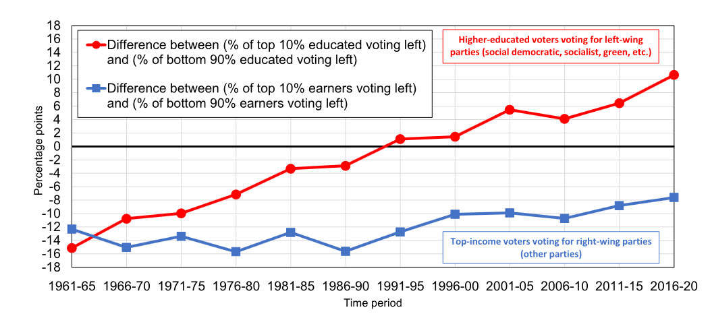
```

Tradicionalmente, o teorema do eleitor mediano é aplicado na escala direita-esquerda, e principalmente com base na renda: o gráfico mostra que pessoas mais ricas sempre votaram mais para partidos de direita &mdash; no passado, isso também era verdade para pessoas mais educadas, mas recentemente isso se inverteu `r Citep(myBib, "gethin2022brahmin")`

---
class: middle

```{r, echo=FALSE, out.width = '50%', fig.show='hold'}
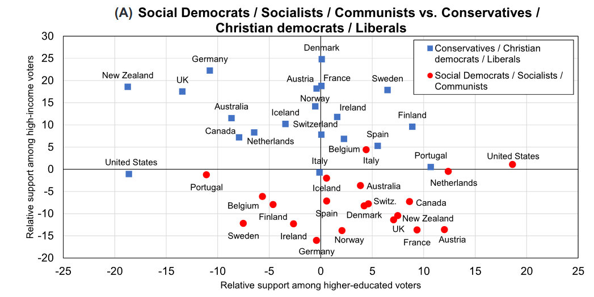
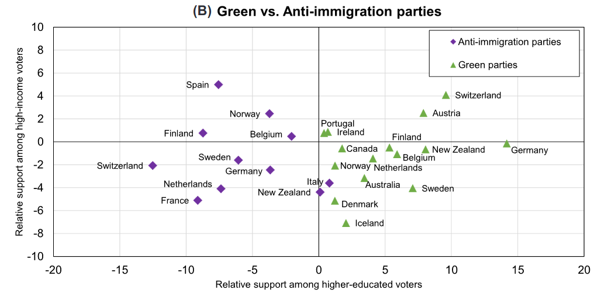
```

Isso leva `r Citep(myBib, "gethin2022brahmin")` a propor uma escala *bidimensional* de conflito político: uma dimensão de "conflito de classes", direita vs esquerda (baseada na renda), e uma dimensão sociocultural, de "cosmopolita vs nativista" (baseada em educação), e dois tipos de elites: a "direita mercantil" e a "esquerda Brahmin"

---
class:middle
# Referências
<small>
```{r refs, echo=FALSE, results="asis"}
PrintBibliography(myBib, start=1)
```
</small>

