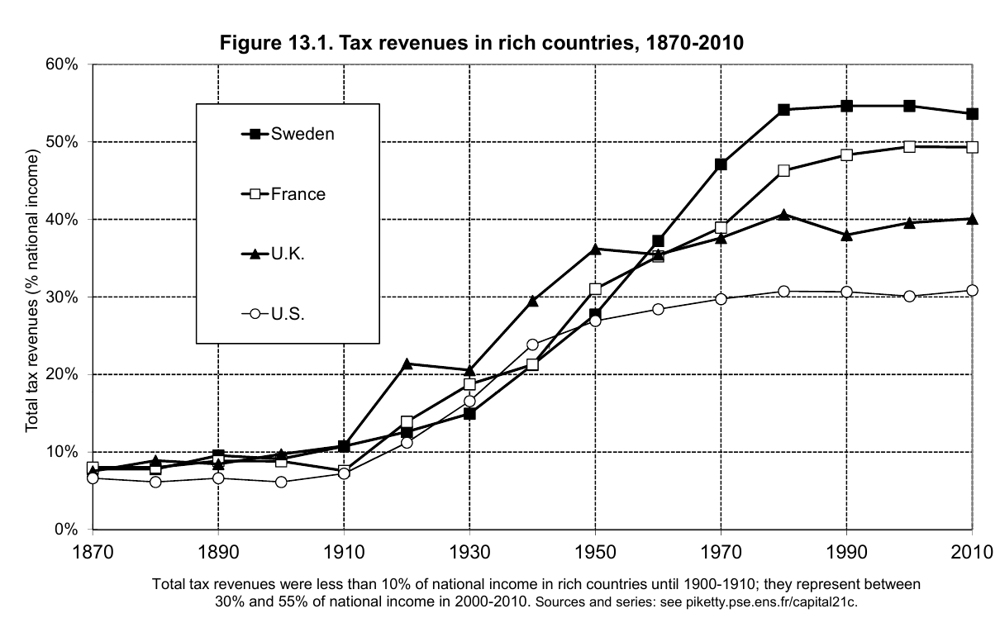
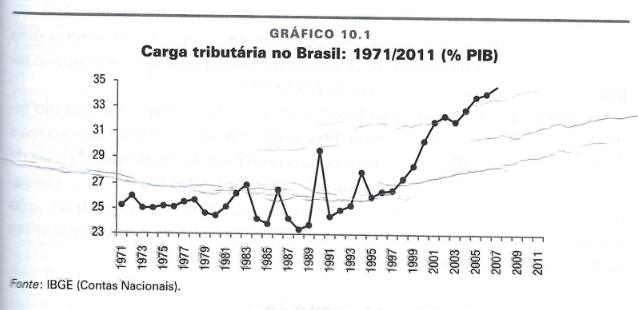
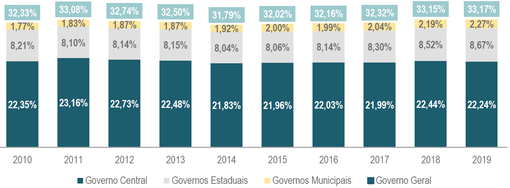
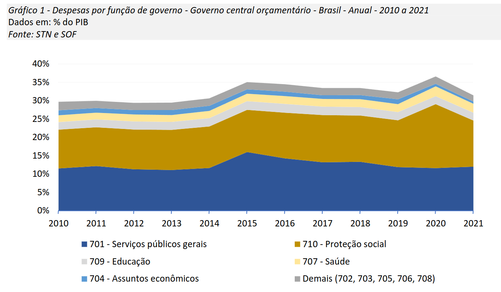
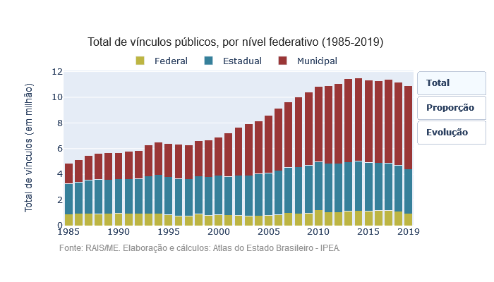
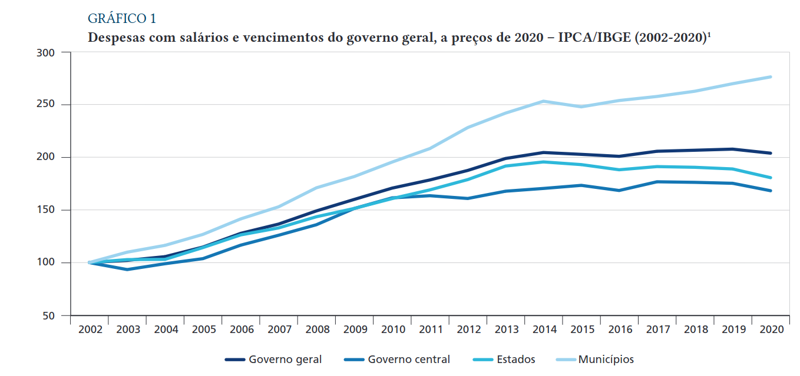
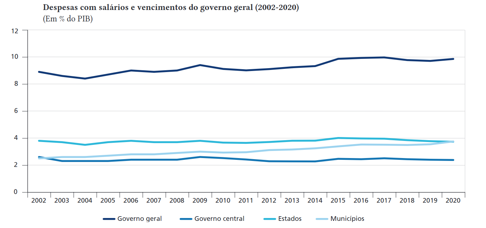

class: inverse, middle, center

```{r, load_refs, include=FALSE, cache=FALSE}
library(RefManageR)
BibOptions(check.entries = FALSE,
           bib.style = "alphabetic",
           cite.style = "alphabetic",
           style = "markdown",
           hyperlink = FALSE,
           dashed = FALSE)
myBib <- ReadBib("./esp_bib.bib", check = FALSE)
```

# Novo arcabouço fiscal

---
class: middle

```{r, echo=FALSE, out.width = '80%'}

```

`r Citep(myBib, "piketty2018capital")`


---
class: middle

```{r, echo=FALSE, out.width = '90%'}

```

(Giambiagi & Alem)

---
class: middle

```{r, echo=FALSE, out.width = '100%'}

```

(Boletim CTB 2019) 


---
class: middle

```{r, echo=FALSE, out.width = '100%'}

```

(Boletim COFOG 2022)

---
class: middle

```{r, echo=FALSE, out.width = '80%', fig.align="center"}

```

[(Atlas do Estado Brasileiro/IPEA)](https://www.ipea.gov.br/atlasestado/)

---
class: middle

```{r, echo=FALSE, out.width = '100%'}

```

`r Citep(myBib, "orair")`

---
class: middle

```{r, echo=FALSE, out.width = '100%'}

```

`r Citep(myBib, "orair")`

---
class:middle
# Referências
<small>
```{r refs, echo=FALSE, results="asis"}
PrintBibliography(myBib, start=1)
```
</small>

