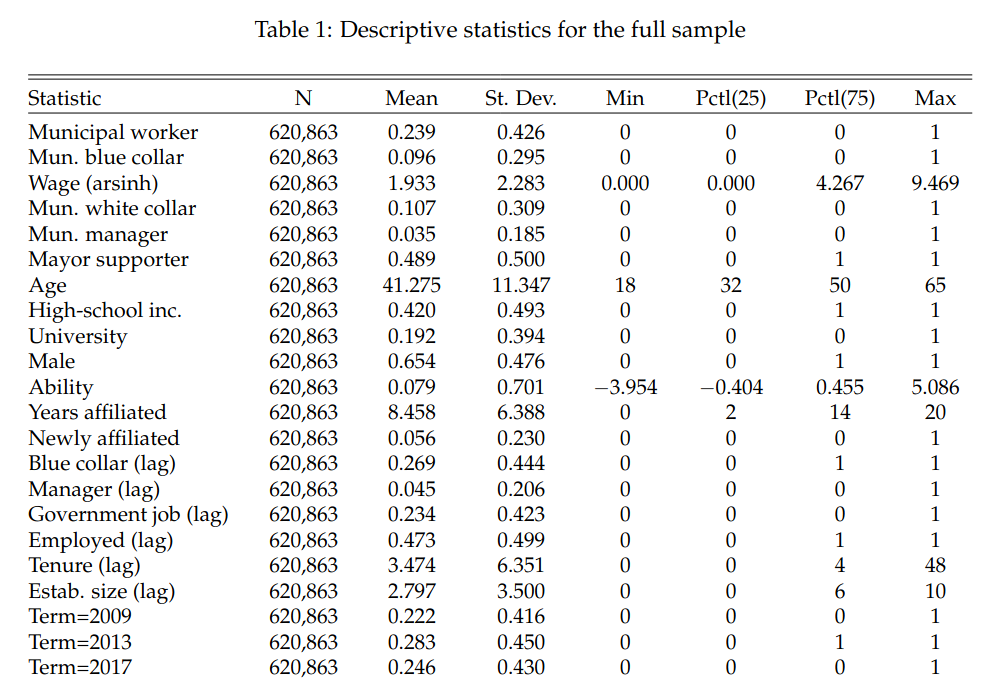
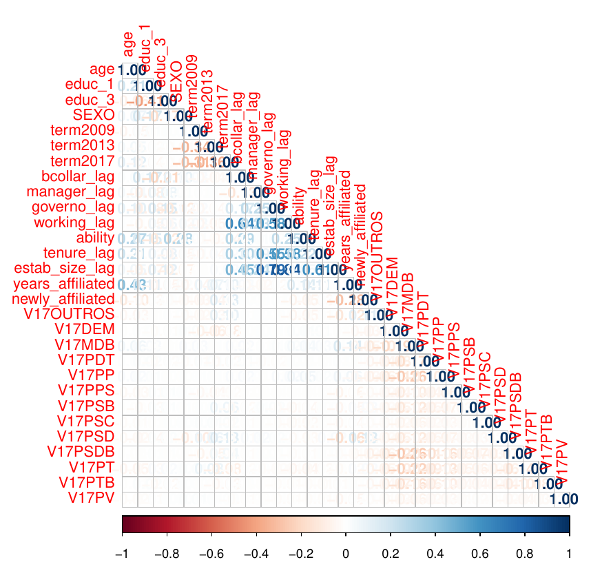
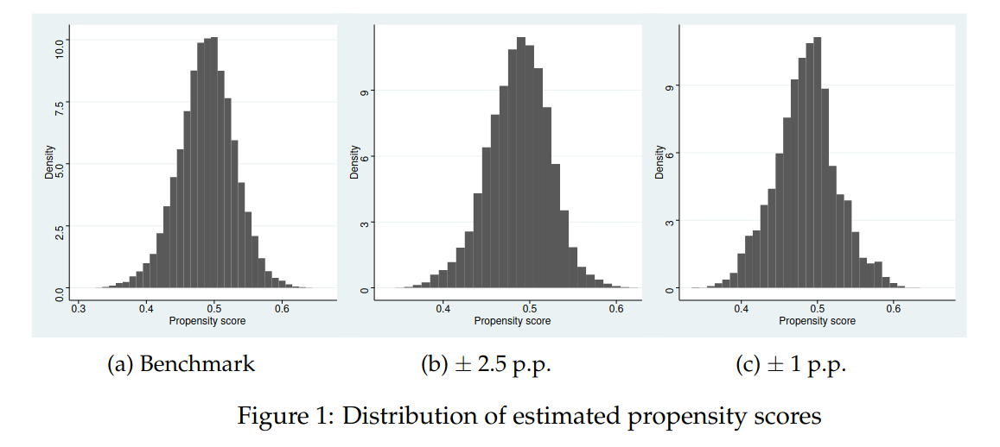
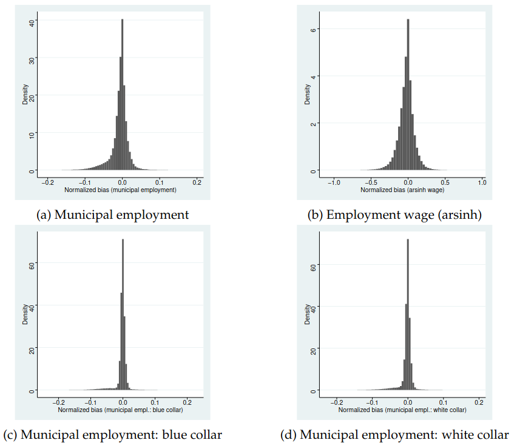
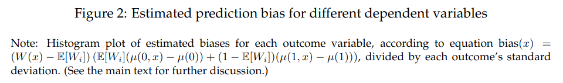
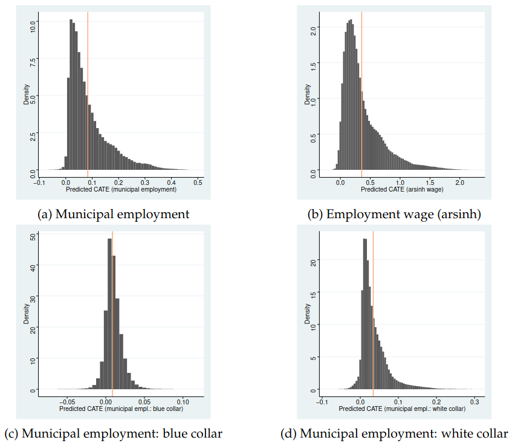
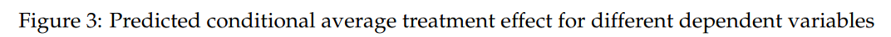
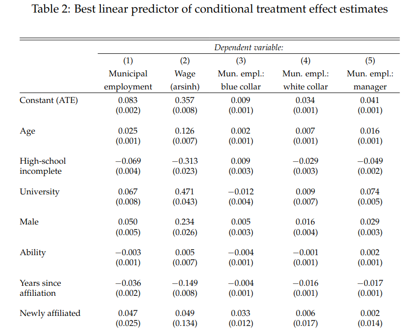
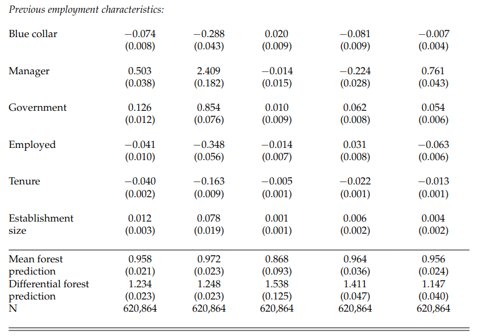
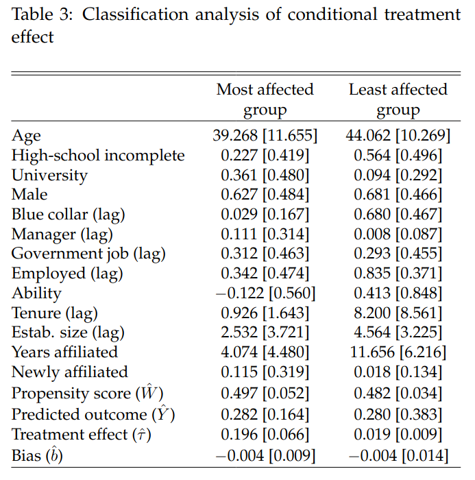

class: inverse, middle, center

# Introduction

---
class: middle

## Introduction

Improving bureaucratic quality in developing countries is essential for better provision of public goods and for economic development

Recent evidence has shown that political connections frequently determine entry into the government service, especially at the local level (patronage)

Patronage in public hiring is when politicians use their appointment power of public workers to reward supporters or friends

---
class: middle
## Motivation

The use of public resources to reward political supporters might reduce efficiency and welfare: it distorts public good provision and leads to rent-seeking

However, this does not have to be so: if workers hired for their political connection are nonetheless well educated and competent, then even if ubiquitous, patronage will not be very harmful to state capacity

Understanding what motivates it and who is selected to patronage appointments then is important to improve bureaucratic efficiency

---
class: middle

## This paper

We compare in close elections the municipal employment outcomes of affiliates to the party that narrowly won with affiliates to the party that narrowly lost (RDD)

Proceeding from that, we train a machine learning causal forest model to estimate heterogeneity in the conditional average treatment effects (CATE), that is, the effect of patronage conditional on worker characteristics

Better understanding *who* benefits the most from patronage hopefully will allow us to better understand what is behind it and its effects

---
class: middle

## Outline of results

Being politically connected to the elected mayor has strong *causal* effect on the probability of being employed in municipal sector, and on public sector wages, especially in management and white collar occupations

This effect is stronger for more highly educated employees, suggesting positive selection of political connections to the public sector, although estimated ability is lower

The effect is also stronger for the newly affiliated, indicating that these hires are to reward political supporters (patronage), and that connection to the mayor is more important than to the party

---
class: middle
## Literature review

Our paper relates to a growing literature on determinants of public bureaucracy efficiency, especially in developing countries: Akhtari et al (2022), Dahis, Schiavon, & Scot (2020), Moreira & Perez (2022), Weaver (2021), Xu (2018)

Particularly to the causal estimation of the effect of being a supporter of elected mayors on public employment in municipalities, with a focus on Brazil: Barbosa and Ferreira (2019), Brassiolo et al. (2020), Brollo et al. (2017), Colonnelli et al. (2020)

This paper also relates to a recent literature on machine learning tools for causal analysis, particularly estimating heterogeneity in treatment effects: Athey & Wager (2019), Chernozhukov, Demirer, Duflo, & Fernandez-Val (2018), Hsu & Shen, (2019), Nie & Wager (2021), Wager & Athey (2018)

---
class: inverse, middle, center

# Data and institutional background

---
class: middle

## Brazilian municipalities

Brazil is a federation democracy with 5,570 municipalities &mdash; we restrict to municipalities under 200,000 voters, which have a plurality system

Most public goods, especially education and health care, are provided by municipalities &mdash; they account for almost 60% of public employment and 6.25% of Brazilian working force

Brazil has a sizable public wage premium, but mostly federal and (to a lesser degree) state employees: the average wage for municipality workers (2017) was US$600/month

---
class: middle

## Party affiliation and political parties

Our measure of political support is party affiliation: it gives us enough observations to train our causal forest

11 million party affiliates in Brazil (2008), over 6% of the entire electorate: PT, PSDB, and PMDB, had then almost 1.5 million affiliates each

New party affiliations are heavily concentrated on months exactly one year before the election &mdash; presumably, this is due to mayoral candidates bringing supporters to influence intra-party democracy

---
class: middle

## Data

Municipality employment from RAIS (Relação Anual de Informações Sociais), administrative data gathered by the Brazilian federal government, which registers the universe of formal (public and private) labor relations in Brazil

Unfortunately, no information on informal employment relations, but contains the entirety of public employees (our focus)

Merge this information with open access party affiliation records by name and electoral results for 2004-16 municipal elections

---
class: middle

```{r, echo=FALSE, out.width = '75%', fig.align='center'}

```

---
class: middle

```{r, echo=FALSE, out.width = '65%', fig.align='center'}

```


---
class: inverse, middle, center

# Empirical strategy


---
class: middle
## Empirical strategy

I investigate the effect of being affiliated to the party of the winning candidate (in close elections), $W_i$, in five outcomes related to public sector employment $Y_i$, and how this differ for affiliates with different covariates/features $X_i$:

1. being employed in the the municipal public sector;
2. inverse hyperbolic sine of wages; 
3. being employed in a blue collar municipal occupation; 
4. being employed in a white collar municipal occupation; and
5. being employed in a managerial municipal occupation.

---
class: middle
## Empirical strategy

Consider an independent and identically distributed sample of size $n$, that contains pre-treatment covariates (features) $X_i$ of dimension $d$, a real-valued response $Y_i$ and a treatment $W_i \in \{0, 1\}$

I employ the potential outcomes framework, and we are interested in estimating conditional average treatment effects (CATE) of the form $$\tau (x) \equiv \mathbb{E} [ Y_i (1) − Y_i (0) | X_i = x],$$

where $Y_i(1)$ is the outcome $i$ gets when treated and $Y_i(0)$ when untreated


---
class: middle
## Identification assumption

I adopt the **local randomization framework**: in close elections, treatment assignment (election victory) is effectively random

This assumption implies unconfoundedness: $\{ Y_i (1), Y_i (0) \} \perp W_i | X_i$, an assumption sufficient for identification of conditional average treatment effects in our environment

Our identification assumption is that electoral performance varies continuously with non-observable attributes, so in a sufficiently close interval from zero margin of victory, our treatment $W_i$ is as good as random

---
class: middle
## Random forest

A basic machine learning method is decision trees, where the space of features is divided by binary partitioning and we predict the regression with the mean of the dependent variable within each rectangle

The binary partition is chosen with a *greedy algorithm* that chooses the splitting variable and splitting point in order to minimize sum of squared of errors

Random forests are a ensemble learning method that aggregates the result of many random decision trees trained on random subsets of the original data with a random subsample of features

---
class: middle
## Causal forest

A recent literature has employed random forests suitably modified to estimate causal effects, both average treatment effects (ATE) and conditional average treatment effects (CATE) - we use the package `grf` in `R` (Athey et al, 2019)

The idea is that as in a binary decision tree, we divide the feature space in rectangles, and compute the ATE within each leaf

Athey and Imbens (2016) introduced the idea of *honest partitioning*, where we use half the sample to define the leaves and another subsample to estimate CATE using those leaves

---
class: middle
## Causal forest

I nonparametrically estimate conditional expectations $Y (x) = \mathbb{E} [ Y_i | X_i = x]$ and $W (x) = \mathbb{E} [ W_i | X_i = x]$ using a boosting regression forest

Then I center the outcome and treatment by the keep-one-out expectations $\tilde{W}_i = W_i − W^{(−1)}(x)$ and $\tilde{Y}_i = Y_i − Y^{(−1)}(x)$

I then compute random forest weights for each value of $x$ and use them to do a projection of locally weighted outcomes on locally weighted treatment values

---
class: middle

```{r, echo=FALSE, out.width = '75%', fig.align='center'}

```

Estimated propensity scores $W(x)$ vary little from 50% in all thresholds, suggesting that near the election cut-off assignment is as good as random

---
class: middle

```{r, echo=FALSE, out.width = '75%', fig.align='center'}


```


---
class: inverse, middle, center

# Results

---
class: middle

## Average treatment effect

Being politically connected to the mayor’s party causally increases municipal employment by 8.3 p.p., a 39.5% increase over the baseline &mdash; but with large variations

While for managerial positions the effect is a 256% increase over the 1.6% baseline, for white collar occupations 35.4% and for blue collar just 9.3% 

Managerial public workers account for only 14.6% of municipal employees in our sample, they respond for 49% of the effect of political connections on municipal employment

---
class: middle

```{r, echo=FALSE, out.width = '75%', fig.align='center'}


```

---
class: middle
## Best linear predictor of CATE

But a previous literature, including Brollo et al (2017), has already established an effect of political connections on municipal employment &mdash; our main contribution is study heterogeneity in treatment effect

We do so by studying how conditional treatment effects vary by individual characteristics &mdash; we start by finding the best linear predictor of CATE given our features

This gives us what characteristics are related to a stronger treatment effect of being politically connected to the mayor on municipal employment

---
class: middle
## Best linear predictor of CATE

Although the ATE estimate is causal (given the local randomization framework), the same is not true for heterogeneity analysis

However, we improve upon previous exercises because our linear predictor is projected on municipality, year, and party dummies and considers all sources of heterogeneity at once

Although still not causal, this makes the analysis more robust than simple interactions tried in previous research

---
class: middle

```{r, echo=FALSE, out.width = '75%', fig.align='center'}

```


---
class: middle

```{r, echo=FALSE, out.width = '75%', fig.align='center'}

```

---
class: middle
## Best linear predictor of CATE

We find that older and male workers benefit the most from patronage: each year above the mean adds 0.25p.p. to treatment effect, and being male adds 5 p.p. to the causal probability of being hired when connected to the mayor

In terms of worker quality, unlike previous literature, we find that the well educated are positively selected: while treatment effect is essentially 0 for those with incomplete high-school, it is 12.1 p.p. for the university educated

On the other hand, if we proxy worker ability by individual fixed effects in a Mincerian equation, then we find that treatment effect is decreasing in ability

---
class: middle
## Best linear predictor of CATE

Finally, another contribution of our research is to note that being affiliated to the party of the winning mayor is more valuable for those newly affiliated: each year of party tenure corresponds to 0.42 p.p. lower TE (5% of the ATE)

As aforementioned, the year before the election is when most party affiliation occurs, presumably to affect intra-party election &mdash; I conjecture that for these affiliates patronage could be more significant

And indeed it is the case: newly affiliated workers are associated with 4.4 p.p. higher TE of political connections, half of the ATE

---
class: middle
## Classification analysis

The best linear predictor of CATE is one way of aggregating CATE estimates, another is to define subgroups by their treatment effect size and analyze the different average characteristics in each group

We divide the sample by quartile of CATE size on municipal employment, and compare the most affected quartile with the least affected quartile

Treatment is highly heterogeneous: while the most affected quartile has CATE of 0.21 (std. 0.004), 3x the ATE, the least affected group has economically insignificant effect of 0.01 (std. 0.002).


---
class: middle

```{r, echo=FALSE, out.width = '55%', fig.align='center'}

```

---
class: middle
## Classification analysis

We see that the most affected group is slightly younger, but much more educated: the share with university education is 4 times higher than in the least affected group

2/3 of the most affected group are unemployed, the rest mostly working in government &mdash; the least affected group is almost entirely working, mostly on private sector and in blue collar occupations.

Finally, the highest quartile is on average affiliated to the mayor’s party for 4 years, with 11% of them affiliated the year before the election, while for the lowest quartile it is 11 years, and only 1.8% of them new affiliates.

---
class: middle

## Conclusion

The fact that newly affiliated party members are more likely to be hired by political connections indicates that these hirings are indeed a form of patronage (versus, for example, ideological match)

However, we find that these patronage workers are *positively* selected on education &mdash; on the other hand, they have lower estimated ability, tenure and are more likely to be unemployed

A possible interpretation of these results is that mayors use their appointing power to reward political supporters that are observationally of good quality, but do not have good stable jobs in the private sector
